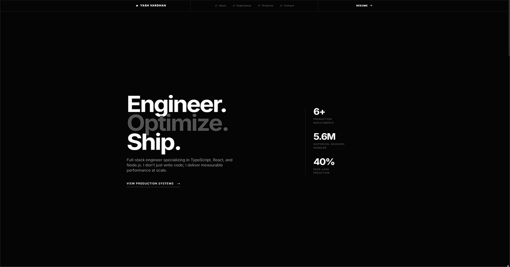

# Yash Vardhan | Engineered Portfolio ⚙️

[](https://yash-pluto.vercel.app)
[](https://nextjs.org/)
[](https://tailwindcss.com/)



A high-performance, brutalist portfolio engineered for precision. 

Designed to cut through the noise, this site relies on a near-black (`#050505`) canvas, architectural typography, and cinematic motion. It serves not just as a resume, but as a live demonstration of full-stack optimization, real-time data integration, and responsive system design.

## 📊 Telemetry & Performance

Engineered to handle massive scale while maintaining near-perfect web vital audits.

- **Total Sessions (30 Days):** 5.6M+
- **Performance:** 99 / 100
- **Accessibility:** 99 / 100
- **Best Practices:** 100 / 100
- **SEO:** 100 / 100

## ✨ Features

- **Brutalist Architecture:** A zero-distraction, true dark environment. Borders, typography, and spacing are mathematically aligned for a premium, industrial feel.
- **Live Telemetry:** Features a real-time system widget in the footer that pulls live Discord presence, active VS Code environments, and Spotify audio streams using the Lanyard API.
- **Cinematic Boot Sequence:** Custom loading states and seamless page transitions powered by `framer-motion`.
- **Precision Navigation:** Programmatic, smooth-scrolling architecture that bypasses native anchor flaws for flawless mobile and desktop routing.

## 🛠️ Tech Stack

- **Framework:** Next.js
- **Styling:** Tailwind CSS (Custom extended theme)
- **Animation:** Framer Motion
- **Data Integration:** Lanyard REST API
- **Deployment:** Vercel

## 🚀 Local Development

Want to spin up the system locally? Follow these steps:

1. Clone the repository:
   ```bash
   git clone [https://github.com/yash-pluto/portfolio.git](https://github.com/yash-pluto/portfolio.git)
   ```
2. Navigate into the frontend directory:
   ```bash
   cd portfolio/frontend
   ```
3. Install the dependencies:
   ```bash
   npm install
   ```
4. Boot the local development server:
   ```bash
   npm run dev
   ```
5. Open your browser and navigate to `http://localhost:3000`.

## 👨‍💻 System Architect

Engineered by **Yash Vardhan**.

- **Portfolio:** [yash-pluto.vercel.app](https://yash-pluto.vercel.app)
- **GitHub:** [@yash-pluto](https://github.com/yash-pluto)
- **LinkedIn:** [Yash Vardhan](https://linkedin.com/in/vardhan-yash3105)
